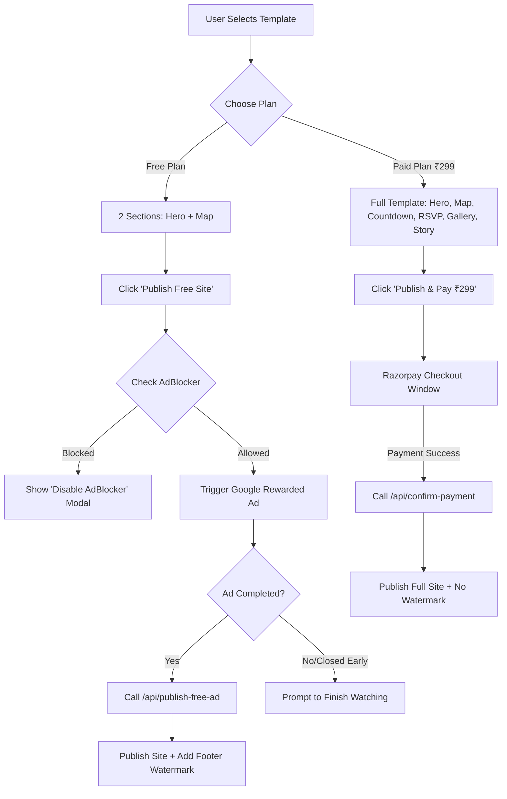

# BRAIN.MD — 2-Tier Strategy: Free (Rewarded Ads) vs Paid (₹299) Web Invites

This document analyzes the product, technical, financial, and architectural strategy for introducing a **2-Tier Model** on WebInvites:
1. **Free Tier**: 2 Sections (Hero + Find Us Map), unlocked by Google Rewarded Ads.
2. **Paid Tier (₹299)**: Full Feature Set (Hero, Find Us, Live Countdown, RSVP, Story, Gallery, Music), unlocked by Razorpay checkout.

---

## 1. Executive Summary & Core Concept

| Feature | Free Tier | Paid Tier (₹299) |
| :--- | :--- | :--- |
| **Target Audience** | Budget-conscious users, quick event hosts, viral lead generation | Couples wanting a full, luxury, interactive wedding website |
| **Sections Included** | 1. Hero Section<br>2. Find Us (Venue & Map) | 1. Hero Section<br>2. Find Us (Venue & Map)<br>3. Live Countdown Timer<br>4. RSVP Form<br>5. Couples Story Section<br>6. Photo Gallery Section |
| **Publishing Mechanism** | Google Rewarded Web Ads (User watches ad to publish) | Instant Razorpay Payment (₹299 flat) |
| **Branding / Watermark** | Small footer watermark ("Created with WEB INVITES") | Clean, premium, zero watermark |
| **Monetization Model** | AdSense Rewarded CPM + Viral Guest Traffic Conversion | Direct Payment (High Margin) |

---

## 2. Deep Dive: Pros & Cons Analysis

### Pros of Free Rewarded Ads Tier

1. **Massive Reduction in Friction (Viral Acquisition Top-of-Funnel)**:
   - Most users hesitate to pay ₹299 upfront before testing. Offering a free 2-section invite removes all payment friction.
   - When a free user publishes their invitation and shares it across WhatsApp groups with 200–500 wedding guests, **all guests see the invitation**.
   - A small "Created with WebInvites — Create yours for Free" footer on free invites creates a **viral acquisition loop**.

2. **Dual Revenue Stream**:
   - Earn direct cash from ₹299 paid customers.
   - Earn passive ad revenue from free users + recurring ad impressions from guests visiting free invitation links.

3. **Upsell Opportunities**:
   - When users start editing a free template, they see locked preview sections (Countdown, Gallery, RSVP). Many users will upgrade to ₹299 mid-editor to unlock those premium sections!

---

### Cons & Technical Challenges

1. **Google Rewarded Ads on Web Inventory & Fill Rates**:
   - Unlike mobile apps (AdMob), Google AdSense Rewarded Ads on the Web (`googletag.defineOutOfPageSlot` or Google Publisher Tag Rewarded Web Ads) have **variable fill rates**, especially in regional Indian markets.
   - **Risk**: If you demand **3 consecutive ads**, Google might only have 1 or 2 ad impressions available for that user's session/IP. If the fill rate drops, the user gets stuck on Ad #2 and cannot publish their site.
   - **Recommendation**: Require **1 Rewarded Video Ad** (or 1 Video Ad + 1 interstitial fallback) instead of 3 consecutive ads.

2. **Ad-Blockers & Client-Side Bypasses**:
   - Modern browsers (Brave, Chrome extensions like uBlock Origin) block `adsbygoogle.js`.
   - **Risk**: If the ad fails to load due to an ad-blocker, the user cannot watch the ad and gets frustrated, OR tech-savvy users bypass client-side JavaScript checks to publish for free without watching ads.
   - **Solution**: Provide a graceful detection message ("Please disable AdBlocker to publish your free invite") AND sign the publish token via server verification.

3. **AdSense Policy & User Experience Capping**:
   - Google AdSense strictly enforces user experience guidelines. Forcing users through 3 long ads in a row can trigger high bounce rates (60–70% drop-off before publishing).
   - A single 15–30 second rewarded ad gives a much higher completion rate (~85–90%).

---

## 3. Recommended Best Architecture & Technical Solution

### Architectural Overview



---

## 4. Implementation Steps & Database Schema

### Database Schema Updates (`invitations` table)

Add two lightweight fields to the `invitations` table in Supabase:
- `plan_type`: `'free'` or `'paid'` (default `'paid'`)
- `ads_watched_count`: integer (tracks completed ad views)

```sql
ALTER TABLE public.invitations 
  ADD COLUMN IF NOT EXISTS plan_type TEXT DEFAULT 'paid' CHECK (plan_type IN ('free', 'paid')),
  ADD COLUMN IF NOT EXISTS ads_watched_count INT DEFAULT 0;
```

---

## 5. Google Rewarded Web Ads Setup Code

Using Google Publisher Tag (GPT) Web Rewarded API:

```javascript
// Load Google Publisher Tag
<Script 
  src="https://securepubads.g.doubleclick.net/tag/js/gpt.js" 
  strategy="afterInteractive" 
/>

// Trigger Rewarded Ad inside Editor
function triggerRewardedAd(onSuccess) {
  window.googletag = window.googletag || { cmd: [] };
  googletag.cmd.push(() => {
    const rewardedSlot = googletag.defineOutOfPageSlot(
      '/1234567/rewarded_ad_unit', 
      googletag.enums.OutOfPageFormat.REWARDED
    );

    if (rewardedSlot) {
      rewardedSlot.addService(googletag.pubads());
      
      googletag.pubads().addEventListener('rewardedSlotReady', (event) => {
        event.makeRewardedVisible();
      });

      googletag.pubads().addEventListener('rewardedSlotGranted', () => {
        // User successfully watched rewarded ad
        onSuccess();
      });

      googletag.display(rewardedSlot);
    }
  });
}
```

---

## 6. Summary Recommendation

1. **Adopt the 2-Tier Strategy**: It will dramatically increase overall site traffic, WhatsApp viral shares, and brand visibility.
2. **Limit to 1 Rewarded Ad (instead of 3)**: Solves Google ad fill rate limitations, prevents user drop-off, and complies strictly with Google AdSense guidelines.
3. **Include a "Created with WebInvites" Footer on Free Invites**: Converts thousands of wedding guests into new paying or free users automatically.
4. **Offer a ₹149 or ₹299 Mid-Editor Upgrade**: Allow free users to upgrade to full sections at any point during editing.
